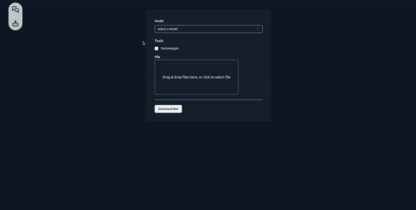

<picture align="center">
  <source media="(prefers-color-scheme: dark)" srcset="https://github.com/ZhihaoAIRobotic/MetaAgent/assets/25542404/4fae92de-f817-4d0f-9f51-a4c8c1c94c3f" width="66%">
  
</picture>

<p align="center"><i>:unicorn:A platform to build, manage and deploy your customized digital humans  and AI agent:robot:. </i></p>

<p align="center">
  <a href="https://github.com/ZhihaoAIRobotic/MetaAgent//#gh-light-mode-only">
    
  </a>
  <a href="https://github.com/ZhihaoAIRobotic/MetaAgent//#gh-dark-mode-only">
    
  </a>
</p>

## Installation
#### 1. Python Environment
```
git clone https://github.com/ZhihaoAIRobotic/MetaAgent.git
conda env create -f environment.yaml
```

#### 2. Minio S3
we use Minio S3 for sending multi-modal messages to frontend. More information about Minio S3 can be found : https://min.io/. 

The service is provided on 192.168.0.20:9000. We use the default access_key and secret_key: "minioadmin:minioadmin". The bucket_name is metaagent.

## Usage
### Without GUI
The usage without GUI is very simple, but you need to use the CURL tool.
1. cd path/to/metaagent
2. Create config.yaml here, fill the key you need:
```
OPENAI_API_BASE: "https://api.openai.com/v1"
OPENAI_API_KEY: "Your Key"
OPENAI_API_MODEL: "gpt-3.5-turbo"
MAX_TOKENS: 1500
RPM: 10

SERPAPI_API_KEY: "Your Key"

SD_URL: "YOUR_SD_URL"
SD_T2I_API: "/sdapi/v1/txt2img"
```
3. python app.py
4. Use CURL to access the http service, there are some examples
```
1. curl --request POST 'http://localhost:60066/default' --header 'Content-Type: application/json' -d '{"data": [{"text": "Make a video of spider man."}]}'
2. curl --request POST 'http://localhost:60066/default' --header 'Content-Type: application/json' -d '{"data": [{"text": "Draw a image of Elon Musk."}]}'
```
5. The CURL will response a link that generated by Minio S3. You can copy this link and check the response content in the web browser.

>Tip: In the usage of the first time, it takes some time to load the model.


### With GUI
>UPCOMING

There is a demo video of old version:



### Http Service
IP address:
```
 http://localhost:60066/default
```

Header: 
```
'Content-Type: application/json'
```

Request: 
```
{"data": [{"text": "draw a picture of Elon"}]}
```

Response: 
```
{"data":[{"id":"id_number","text":[{"id":"id_number","text":"url","bytes_":null,"embedding":null,"url":null}],"image":[{"id":"id_number","text":"url","bytes_":null,"embedding":null,"url":null}],"video":[{"id":"id_number","text":"url","bytes_":null,"embedding":null,"url":null}],"audio":[{"id":"id_number","text":"url","bytes_":null,"embedding":null,"url":null}]}],"parameters":{}}
```
